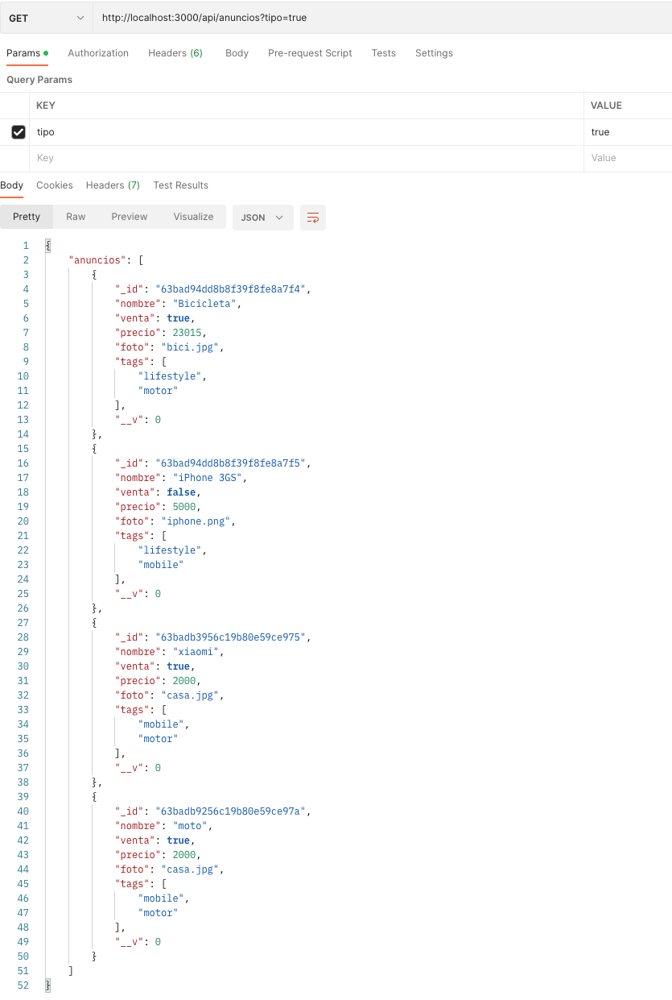

# NodePop

Deploy 

```sh
npm install
```

Star the application in production with :

```sh
node ./bin/www
```

Star the application in development with :

```sh
npm run dev
```

Product list:

GET /api/anuncios

"anuncios":[

    {

        "_id":"63baad7a2b988ee003811463",

        "nombre":"Bicicleta",

        "venta":true,

        "precio":23015,

        "foto":"bici.jpg",

        "tags":["lifestyle","motor"]

    }

]

How to start the MongoDB

From MongoDB folder

```sh
./bin/mongod --dbpath ./data
```

To Start the Mongosh

From Mongosh folder

```sh
./mongosh 
```

Select nodepop DB.

```sh
use nodepop 
```

To add/delete DB for the first time or develop.

```sh
node init-db 
```

Pruebas:

Listado de todos los anuncios.

http://localhost:3000/api/anuncios


Seleccionar un anuncio por ID

http://localhost:3000/api/anuncios/63bad94dd8b8f39f8fe8a7f4


Paginación:

http://localhost:3000/api/anuncios?skip=1&limit=2


Venta (Tipo), tags, Nombre

http://localhost:3000/api/anuncios?skip=1&limit=2



http://localhost:3000/api/anuncios?tags=motor


http://localhost:3000/api/anuncios?min=100&max=2000


Metodo PUT de actualizacion de valore

http://localhost:3000/api/anuncios/63bad94dd8b8f39f8fe8a7f4


Metodo POST para incorporar nuevos productos.

http://localhost:3000/api/anuncios/?nombre=casa&venta=true&precio=10000&foto=D:/foto.jpg&tags=mobile


Metodo DELETE

http://localhost:3000/api/anuncios/63bac56840731b5db54ab7ea


Listado de tags:

http://localhost:3000/api/anuncios/tags


Descargar fotos.

http://localhost:3000/images/anuncios/bici.jpeg


